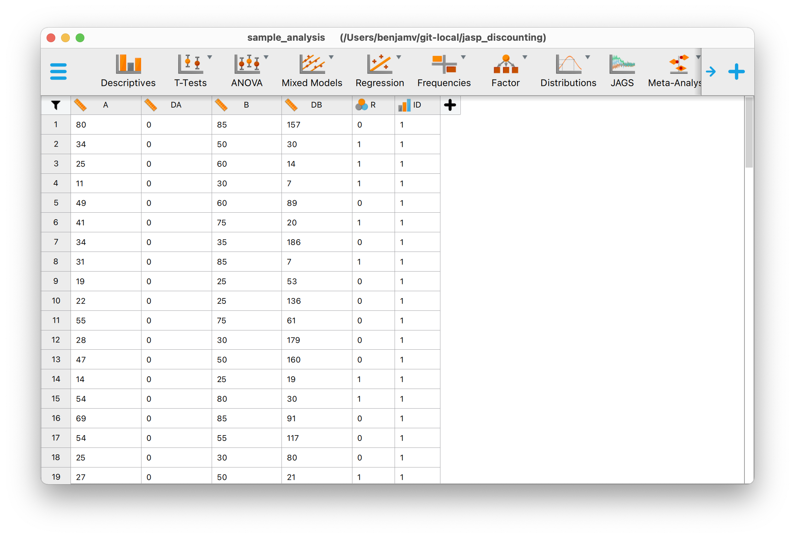
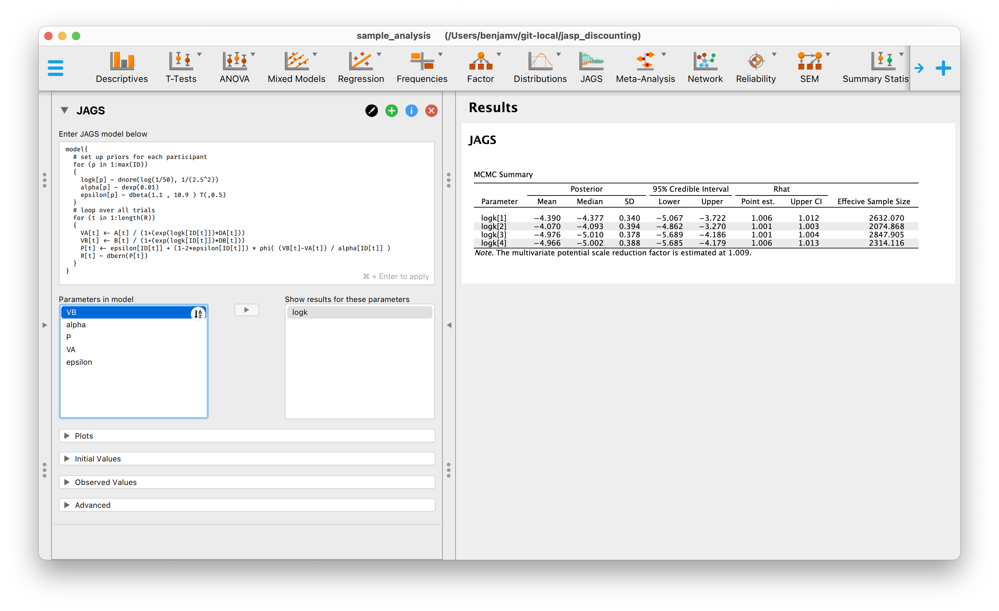
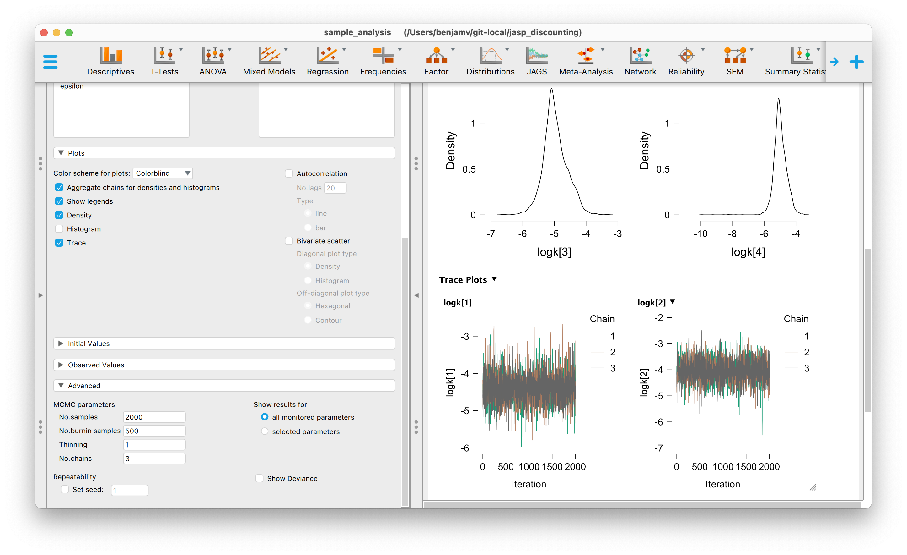

# Bayesian scoring of delay discounting data for non-programmers (in JASP)

If you have raw delay discounting data and you want to score that data using Bayesian methods, then you have come to the right place.

The goal here is maximal accessibility to those who are not familiar with programming. So these steps are pretty easy to follow, but we should note that we cannot do all the advanced things that we might be able to do when using a programming language like Python, Julia, or R.

If you use this work, please cite the following paper:
> Vincent, B. T. (2016). Hierarchical Bayesian estimation and hypothesis testing for delay discounting tasks. Behavior Research Methods. 48(4), 1608-1620. [[Link to paper](https://link.springer.com/article/10.3758/s13428-015-0672-2)]

If you literally love this, then consider [buying me a coffee](https://www.buymeacoffee.com/drben) or just tweet about it. I am [@inferenceLab](https://twitter.com/inferencelab) on twitter.

# Instructions

## Steps to do only once
- Download the latest version of [JASP](https://jasp-stats.org).
- Enable JAGS by running JASP, click on the "+" icon in the top right and check the tick box called "JAGS".

## Data preparation
This might be the only really taxing step... Get your data into the form where you have the following columns:
- `A` = reward magnitude of the smaller sooner reward
- `DA` = delay to the smaller sooner reward
- `B` = reward magnitude of the larger later reward
- `DB` = delay to the larger later reward
- `R` = participant response, coded as 1 = chose larger later, 0 = chose smaller sooner.
- `ID` = participant ID. These need to be `1, 2, 3, ... N`.

Each row will correspond to a single trial (choice) of the delay discounting experiment.

This needs to be saved in `.csv` format for easy import to JASP. If you are preparing your data in excel, you can simply export as a `.csv` file.

## Import data into JAGS
- Open up JAGS and `Open > Computer > Browse`. If you want you can use the sample data from just 4 participants (`sample_data.csv`). You should end up with something that looks like this:



- Create a JAGS analysis block by clicking on the JAGS icon in the top ribbon of JASP.

- Enter the following JAGS model code. This particular model equates to a relatively simple model which treats the participants independently - there is no hierarchical estimation in this model. Other JAGS models are provided below.

```
model{
  # set up priors for each participant
  for (p in 1:max(ID))
  {
    logk[p] ~ dnorm(log(1/50), 1/(2.5^2))
    alpha[p] ~ dexp(0.01)
    epsilon[p] ~ dbeta(1.1 , 10.9 ) T(,0.5)
  }
  # loop over all trials
  for (t in 1:length(R))
  {
    VA[t] <- A[t] / (1+(exp(logk[ID[t]])*DA[t]))
    VB[t] <- B[t] / (1+(exp(logk[ID[t]])*DB[t]))
    P[t] <- epsilon[ID[t]] + (1-2*epsilon[ID[t]]) * phi( (VB[t]-VA[t]) / alpha[ID[t]] )
    R[t] ~ dbern(P[t])
  }  
}
```
> This model scores delay discounting data according to the hyperbolic discounting model. The parameters for each participant are estimated independently. The core parameters is the log discount rate `logk`. However each participant also has parameters relating to response accuracy: `alpha` is a comparison acuity parameter which models how accurately they can compare present subjective values, and `epsilon` is a lapse rate corresponding to proportion of random responses. Ideally `alpha` and `epsilon` are low values. See Vincent (2016) for more information.

- Click `Command` and `+` (or whatever the equivalent is on a PC) and the model will run. If you get a message saying "Please specify which parameters to show output for!" then find `logk` in the list of model parameters and move it to the box on the right. You can do that by dragging, or by clicking on the right facing arrow.

By now you should have some results that look like this:



This is quite possibly sufficient to do the job... you now have a list of posterior mean values of the `logk` variable. You can feel free to use these values as your Bayesian scored discount rates. However you may want to do some extra due diligence.

## Due diligence

It is good practice to check that these results are meaningful estimates of the posterior means by checking convergence. If you click to see the `Density` and `Trace` plots then this can help. For the trace plots, you want to check that the chains overlap as a visual check that they are representing the same posterior distribution. Disagreement here is a bad thing.

You might also want to check the posterior density plots as a sanity check to see if they make sense to you.



To get really accurate results, you might also want to increase the number of  samples. If there are issues with the chains then you could increase the number of burn-in samples. 

I would also recommend that you set a random seed value in the Advanced tab. This will help others to be able to precisely replicate your results.

# Alternative models
You can do a different analysis by pasting in different JAGS models. Here are a list of models. This list will grow over time if people find this useful - but let me know through [@inferenceLab](https://twitter.com/inferencelab) on twitter, or create an Issue here on GitHub.

## Exponential discounting
The key parameter here is `k`, so make sure that is added in the 'show results for these parameters' box.

```
model{
  # set up priors for each participant
  for (p in 1:max(ID))
  {
    k[p] ~ dnorm(0.01, 1/(0.5^2))
    alpha[p] ~ dexp(0.01)
    epsilon[p] ~ dbeta(1.1 , 10.9 ) T(,0.5)
  }
  # loop over all trials
  for (t in 1:length(R))
  {
    VA[t] <- A[t] * (exp(-k[ID[t]]*DA[t]))
    VB[t] <- B[t] * (exp(-k[ID[t]]*DB[t]))
    P[t] <- epsilon[ID[t]] + (1-2*epsilon[ID[t]]) * phi( (VB[t]-VA[t]) / alpha[ID[t]] )
    R[t] ~ dbern(P[t])
  }  
}
```


# References
Vincent, B. T. (2016). Hierarchical Bayesian estimation and hypothesis testing for delay discounting tasks. Behavior Research Methods. 48(4), 1608-1620.